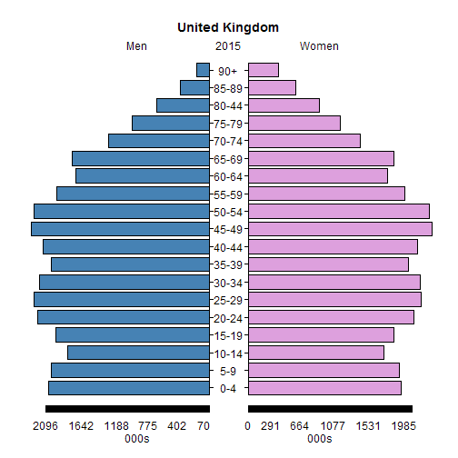

## Projections Project
<br>
### Developing Data Products 
### Assignment
<br><br>
### Ian
BugBunny

---

### Population Projections
### for the UK

* The assignment was to code and deploy an interactive web app using the R package _shiny_.

* 'Demography is destiny' according to Auguste Comte, or maybe Wattenberg and Scammon (1970).

* This app computes population projections for the United Kingdom for 2015-50 using forecasts of total fertility chosen by the user. It can produce a population pyramid for the mid- or end-point of any decade within this period that the user selects.

* Thereby, it enables the user to visualize how women's changing family sizes might affect the future size and age structure of the British population.

---

### A ___static___ population pyramid


```r
library(plotrix); pyramid.plot(Men, Women, lxcol = "steelblue", 
   rxcol = "plum", unit = "000s", labels = rep("", 19),
   top.labels = c("Men", "2015", "Women"), gap = 0)
```

 

```
## [1] 5.1 4.1 4.1 2.1
```

---

### The power of _shiny_

<br>

<p style="text-align: left;"> The app demonstrates several features of <em>shiny:</em></p>

<br>

* <div class="fragment"> Panelled web page layouts, including tabbed panels</div>
* <div class="fragment"> Use of widgets for input (sliders, dropdown boxes)</div>
* <div class="fragment"> Reactive code that runs if the sliders change, but not when the dropdown box does</div>
* <div class="fragment"> Two types of reactive output (text and a chart)</div>
* <div class="fragment"> Web hosting on the shinyapps.io server</div>

---

### Accessing the app and the code

<br>

The app is hosted on _RStudio_'s shiny apps server:  
https://bugbunny.shinyapps.io/ProjectionsProject  

<br>

The R scripts containing the code are on GitHub:  
https://github.com/BugBunny/ProjectionsProject

<br>

<p style="font-size: 50%;">Projections App. Copyright (C) 2015 - Ian Timaeus</p> 
<p style="font-size: 50%;">This program comes with ABSOLUTELY NO WARRANTY;
this is free software, and you are welcome to redistribute it
under certain conditions; see http://www.gnu.org/licenses/gpl.html</p>
